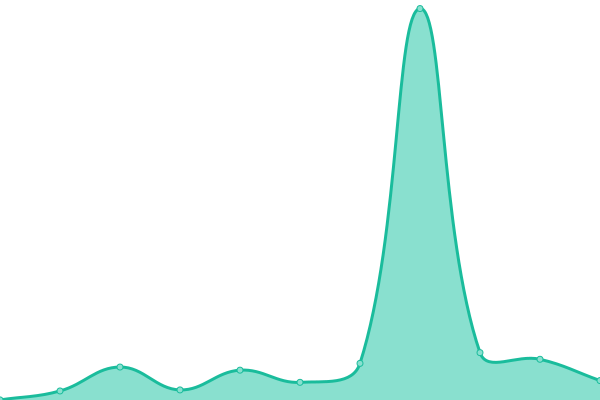

# Kotatsu Club Status

<!--start: status pages-->
<!-- This summary is generated by Upptime (https://github.com/upptime/upptime) -->
<!-- Do not edit this manually, your changes will be overwritten -->
<!-- prettier-ignore -->
| URL | Status | History | Response Time | Uptime |
| --- | ------ | ------- | ------------- | ------ |
|  [Kotatsu Club](https://kotatsu.club/robots.txt) | 🟩 Up | [kotatsu-club.yml](https://github.com/kotatsuclub/status/commits/HEAD/history/kotatsu-club.yml) | 

 177ms
     
 | 

<a href="https://status.kotatsu.club/history/kotatsu-club">100.00%</a>
    

<!--end: status pages-->
